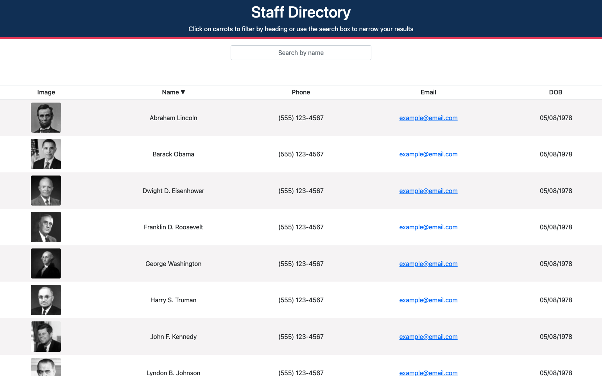

# Staff Directory

## Table of Contents
* [Project Summary](#project-summary)
* [How to Access](#how-to-access)
* [Technologies Used](#technologies-used)
* [About Me](#about-me)
* [Screenshots](#screenshots)
* [Code Snippets](#code-snippets)

## Project Summary
This is an employee directory built using React. You can search the directory by name and sort it alphabetically by name.

## How to Access
* [Staff Directory](https://profjjk.github.io/staff-directory/)

## Technologies Used
* [JavaScript](https://developer.mozilla.org/en-US/docs/Web/JavaScript)
* [React](https://reactjs.org/)

## About Me
* [LinkedIn](https://www.linkedin.com/in/the-real-jordan-kelly/)
* [GitHub](https://github.com/profjjk)

## Screenshots


## Code Snippets
Search the directory by name.
```javascript
  useEffect(() => {
    if (search === "") {
      setEmployees(Employees)
      return;
    }
    let employeeSearch = [];
    for (let i = 0; i < Employees.length; i++) {
      if (Employees[i].name.toLowerCase().includes(search.toLowerCase())) {
        employeeSearch.push(Employees[i]);
      };
    };
    setEmployees(employeeSearch);
  }, [search]);
```
Sort the directory in ascending or descending order by name.
```javascript
  useEffect(() => {
    if (sort === "") {
      setCarrot('\u25BA')
    }
    if (sort === "asc") {
      employees.sort((name1, name2) => {
        let emp1 = name1.name.toLowerCase();
        let emp2 = name2.name.toLowerCase();
        if (emp1 < emp2) {
          setCarrot('\u25BC')
          return -1;
        }
        return 0;
      })
    }
    if (sort === "desc") {
      employees.sort((name1, name2) => {
        let emp1 = name1.name.toLowerCase();
        let emp2 = name2.name.toLowerCase();
        if (emp1 > emp2) {
          setCarrot('\u25B2')
          return -1;
        }
        return 0;
      })
    }
  }, [sort, employees])
```

[](https://opensource.org/licenses/MIT)